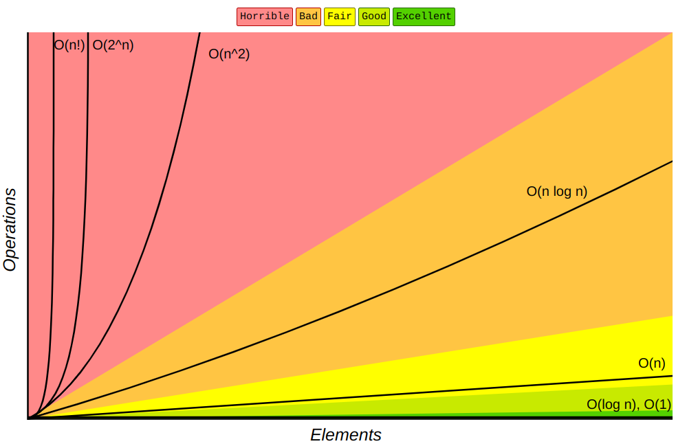
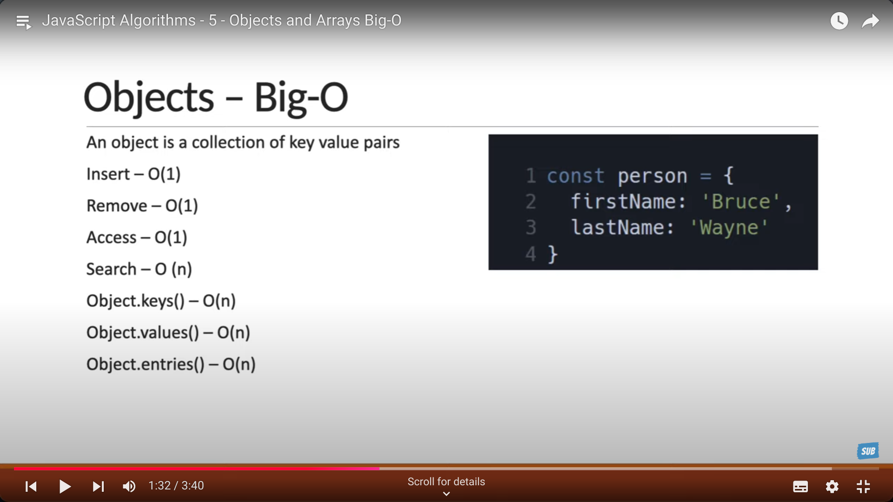
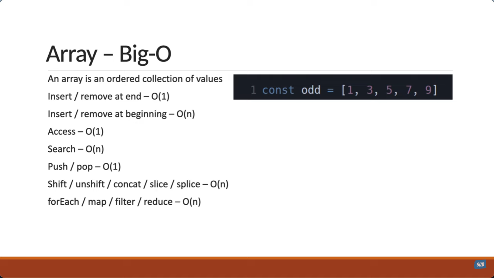

[<- JS DSA](../README.md)

## Big O notation
Big O notation is a mathematical notation that describes the limiting behavior of a function when the argument tends towards a particular value or infinity. It is commonly used to describe the worst-case scenario for how an algorithm performs. It is used to analyze the efficiency of an algorithm in terms of time and space complexity. 



### O(1) - Constant Time
An algorithm is said to have a constant time complexity if the time taken to complete the algorithm does not depend on the size of the input data. It is the best time complexity an algorithm can have.

```javascript
function constantTime(arr) {
  return arr[0];
}

// Example Usage
const array = [1, 2, 3, 4];
const result = constantTime(array);
console.log(result); // Output: 1

// The function always returns the first element of the input array, regardless of the size of the array.
```

### O(n) - Linear Time
An algorithm is said to have a linear time complexity if the time taken to complete the algorithm is directly proportional to the size of the input data.

```javascript
function linearTime(arr) {
  for (let i = 0; i < arr.length; i++) {
    console.log(arr[i]);
  }
}

// Example Usage
const array = [1, 2, 3, 4];
linearTime(array);
// Output: 1, 2, 3, 4

// The loop runs 'n' times, where 'n' is the size of the input array, resulting in a linear relationship between the input size and the time taken. 
```

### O(n^2) - Quadratic Time
An algorithm is said to have a quadratic time complexity if the time taken to complete the algorithm is proportional to the square of the size of the input data.

```javascript
function quadraticTime(arr) {
  for (let i = 0; i < arr.length; i++) {
    for (let j = 0; j < arr.length; j++) {
      console.log(arr[i], arr[j]);
    }
  }
}

// Example Usage
const array = [1, 2, 3, 4];
quadraticTime(array);
// Output: 1 1, 1 2, 1 3, 1 4, 2 1, 2 2, 2 3, 2 4, 3 1, 3 2, 3 3, 3 4, 4 1, 4 2, 4 3, 4 4

// The inner loop runs 'n' times for each iteration of the outer loop, resulting in a total of n * n = n^2 iterations.
```

### O(log n) - Logarithmic Time
An algorithm is said to have a logarithmic time complexity if the time taken to complete the algorithm is proportional to the logarithm of the size of the input data. It is more efficient than linear time complexity. 

```javascript
function binarySearch(arr, target) {
  let left = 0;
  let right = arr.length - 1;

  while (left <= right) {
    const mid = Math.floor((left + right) / 2);

    if (arr[mid] === target) {
      return mid; // Target found, return the index
    }

    if (arr[mid] < target) {
      left = mid + 1; // Search in the right half
    } else {
      right = mid - 1; // Search in the left half
    }
  }

  return -1; // Target not found
}

// Example Usage
const sortedArray = [1, 3, 5, 7, 9, 11];
const targetValue = 7;
const result = binarySearch(sortedArray, targetValue);
console.log(result); // Output: 3 (index of 7 in the array)

// At each step, the size of the array to search is halved.
// This halving process continues until the target is found or the array is empty, resulting in logarithmic time complexity.
```

### O(n log n) - Linearithmic Time
An algorithm is said to have a linearithmic time complexity if the time taken to complete the algorithm is proportional to the product of the size of the input data and the logarithm of the size of the input data.

```javascript
function mergeSort(arr) {
  if (arr.length <= 1) {
    return arr; // Base case: arrays of size 0 or 1 are already sorted
  }

  const mid = Math.floor(arr.length / 2);
  const left = mergeSort(arr.slice(0, mid)); // Recursively sort the left half
  const right = mergeSort(arr.slice(mid)); // Recursively sort the right half

  return merge(left, right); // Merge the sorted halves
}

function merge(left, right) {
  const sorted = [];
  let i = 0, j = 0;

  // Merge the two sorted arrays
  while (i < left.length && j < right.length) {
    if (left[i] < right[j]) {
      sorted.push(left[i]);
      i++;
    } else {
      sorted.push(right[j]);
      j++;
    }
  }

  // Add any remaining elements
  return sorted.concat(left.slice(i)).concat(right.slice(j));
}

// Example Usage
const array = [38, 27, 43, 3, 9, 82, 10];
const sortedArray = mergeSort(array);
console.log(sortedArray); // Output: [3, 9, 10, 27, 38, 43, 82]

// Splitting the array takes O(log n) time because the array is divided into halves recursively.
// Merging all the subarrays back takes O(n) time because every element is processed during merging.
// The total time complexity of merge sort is O(n log n).
```

### O(2^n) - Exponential Time
An algorithm is said to have an exponential time complexity if the time taken to complete the algorithm doubles with each addition to the input data. It is the worst time complexity an algorithm can have.

```javascript
function fibonacci(n) {
  if (n <= 1) {
    return n; // Base case: fibonacci(0) = 0, fibonacci(1) = 1
  }

  return fibonacci(n - 1) + fibonacci(n - 2); // Recursive call
}

// Example Usage
const n = 6;
const result = fibonacci(n);
console.log(result); // Output: 8

// The recursion tree grows exponentially because each call branches into two additional recursive calls.
// The total number of function calls for F(n) is approximately proportional to 2^n.
```

### O(n!) - Factorial Time
An algorithm is said to have a factorial time complexity if the time taken to complete the algorithm increases by a factor of n with each addition to the input data. It is the worst time complexity an algorithm can have.

```javascript
function generateArrangements(people) {
  if (people.length === 1) {
    return [people]; // Base case: only one arrangement for a single person
  }

  const arrangements = [];
  for (let i = 0; i < people.length; i++) {
    const current = people[i]; // Fix one person
    const remaining = people.slice(0, i).concat(people.slice(i + 1)); // Remaining people
    const subArrangements = generateArrangements(remaining); // Generate arrangements for the remaining people

    for (const sub of subArrangements) {
      arrangements.push([current].concat(sub)); // Add the fixed person to each arrangement
    }
  }

  return arrangements;
}

// Example Usage
const people = ["A", "B", "C"];
const arrangements = generateArrangements(people);

console.log(arrangements);
// Output: All 6 permutations of ["A", "B", "C"]
// [
//   ["A", "B", "C"],
//   ["A", "C", "B"],
//   ["B", "A", "C"],
//   ["B", "C", "A"],
//   ["C", "A", "B"],
//   ["C", "B", "A"]
// ]

// The number of recursive calls grows by a factor of n with each additional person, resulting in n! recursive calls.
// The number of possible arrangements (permutations) of n items is n!.
// This results in an O(n!) complexity as all possible orderings are explored.
```

### Summary
- **O(1)**: Constant time complexity. The algorithm takes the same amount of time to complete regardless of the input size.
- **O(n)**: Linear time complexity. The time taken to complete the algorithm increases linearly with the input size.
- **O(n^2)**: Quadratic time complexity. The time taken to complete the algorithm increases quadratically with the input size.
- **O(log n)**: Logarithmic time complexity. The time taken to complete the algorithm increases logarithmically with the input size.
- **O(n log n)**: Linearithmic time complexity. The time taken to complete the algorithm increases linearithmically with the input size.
- **O(2^n)**: Exponential time complexity. The time taken to complete the algorithm doubles with each addition to the input data.
- **O(n!)**: Factorial time complexity. The time taken to complete the algorithm increases by a factor of n with each addition to the input data.

## Big O of Objects


## Big O of Arrays


---

[<- JS DSA](../README.md)
