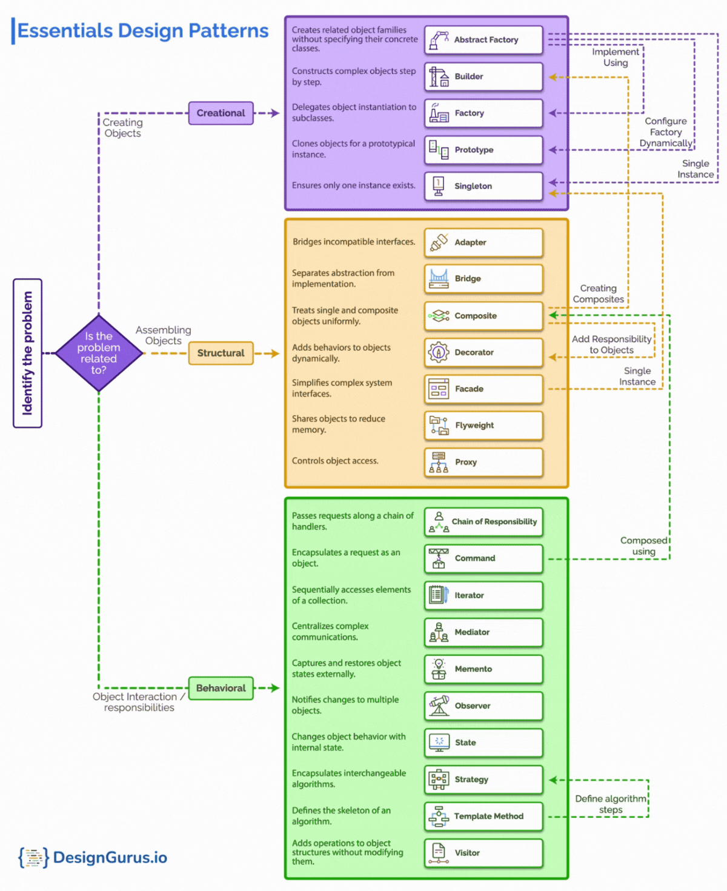

[<- Design Patterns](design-patterns-quick.md)

# JS Design Patterns
1. [JavaScript Design Patterns](https://www.dofactory.com/javascript/design-patterns)

# Categories of Design Patterns

## Creational Design Patterns
These patterns deal with object creation mechanisms, trying to create objects in a manner suitable to the situation. The basic form of object creation could result in design problems or added complexity to the design. Creational patterns solve this problem by somehow controlling this object creation.

1. **Singleton**: Ensures a class has only one instance and provides a global point of access to it.
2. **Factory Method**: Defines an interface for creating objects, but lets subclasses decide which class to instantiate.
3. **Abstract Factory**: Provides an interface for creating families of related objects without specifying their concrete classes.
4. **Builder**: Constructs complex objects step by step, separating the construction process from the final object.
5. **Prototype**: Creates new objects by cloning an existing object, used when object creation is costly or complex.

## Structural Design Patterns
These patterns focus on how classes and objects are composed to form larger structures. Structural patterns ease the design by identifying a simple way to realize relationships among entities.

1. **Adapter (Wrapper)**: Allows incompatible interfaces to work together by wrapping one interface with another.
2. **Composite**: Treats individual objects and compositions of objects uniformly, forming part-whole hierarchies.
3. **Proxy**: Provides a surrogate or placeholder object that controls access to another object.
4. **Flyweight**: Reduces memory usage by sharing common parts of an object across multiple instances.
5. **Facade**: Simplifies the interface of a complex system by providing a higher-level, unified interface.
6. **Bridge**: Separates an abstraction from its implementation, allowing both to vary independently.
7. **Decorator**: Dynamically adds new responsibilities to objects by wrapping them without modifying their structure.

## Behavioral Design Patterns
These patterns are concerned with algorithms and the assignment of responsibilities between objects. They characterize complex control flow that's difficult to follow at run-time. Behavioral patterns shift your focus away from flow of control to let you concentrate just on the way objects are interconnected.

1. **Observer**: Defines a one-to-many dependency where observers are notified of state changes in a subject.
2. **Strategy**: Encapsulates interchangeable algorithms and allows them to be selected at runtime.
3. **Command**: Encapsulates a request as an object, allowing for parameterization, queuing, and undoable operations.
4. **Iterator**: Provides a way to access elements of a collection sequentially without exposing its underlying structure.
5. **State**: Allows an object to change its behavior when its internal state changes, making it appear to change class.
6. **Visitor**: Separates algorithms from the objects on which they operate, allowing new operations to be added without modifying the objects.
7. **Mediator**: Centralizes communication between objects, reducing direct dependencies between them.
8. **Memento**: Captures and restores an object's internal state without exposing its implementation.
9. **Chain of Responsibility**: Passes a request along a chain of handlers until one of them handles the request.
10. **Template Method**: Defines the skeleton of an algorithm, allowing subclasses to redefine specific steps without changing its overall structure.


# How to choose a Design Pattern?


# Creational design patterns
These creational design patterns focus on ways to efficiently manage and create objects in a system. Each pattern addresses a specific problem, such as managing single instances (Singleton), abstracting object creation (Factory Method and Abstract Factory), simplifying complex constructions (Builder), or cloning objects (Prototype).

## 1. Singleton Pattern:
The Singleton pattern ensures that a class has only one instance throughout the lifetime of an application and provides a global point of access to that instance. This is useful when exactly one object is needed to manage shared resources, such as a configuration manager, logging system, or connection pool.

### Implementation:
```javascript
class Singleton {
  constructor() {
    if (Singleton.instance) {
      return Singleton.instance;
    }
    this.data = "I am a Singleton!";
    Singleton.instance = this;
  }

  getData() {
    return this.data;
  }
}

// Usage
const singleton1 = new Singleton();
const singleton2 = new Singleton();

console.log(singleton1 === singleton2); // true
console.log(singleton1.getData()); // "I am a Singleton!"
console.log(singleton2.getData()); // "I am a Singleton!"
```
   
### Key Characteristics:
- A private constructor prevents direct instantiation.
- A static method provides controlled access to the single instance.
- The instance is often created lazily (only when it is first needed).
   
### Common Use Cases:
- Logging services
- Database connection managers
- Configuration settings across an application

## 2. Factory Method Pattern:
The Factory Method pattern defines an interface for creating objects but allows subclasses to alter the type of objects that will be created. It delegates the process of instantiation to subclasses, which can provide their own implementation of object creation.

### Implementation:
```javascript
class Animal {
  speak() {
    throw "Subclass must implement this method!";
  }
}

class Dog extends Animal {
  speak() {
    console.log("Woof!");
  }
}

class Cat extends Animal {
  speak() {
    console.log("Meow!");
  }
}

class AnimalFactory {
  createAnimal(type) {
    switch (type) {
      case 'dog':
        return new Dog();
      case 'cat':
        return new Cat();
      default:
        throw new Error("Unknown animal type");
    }
  }
}

// Usage
const factory = new AnimalFactory();
const dog = factory.createAnimal('dog');
dog.speak(); // "Woof!"

const cat = factory.createAnimal('cat');
cat.speak(); // "Meow!"
```

### Key Characteristics:
- A method in a superclass (or interface) is responsible for object creation.
- Subclasses decide which class to instantiate.
- It promotes loose coupling between client code and the actual classes being instantiated.
   
### Common Use Cases:
- GUI frameworks to create platform-specific UI components (buttons, text fields, windows).
- Document processing systems where different types of documents (PDF, Word, Excel) need to be created.
- Game development for creating different character types (hero, enemy, NPC).

## 3. Abstract Factory Pattern:
The Abstract Factory pattern provides an interface for creating families of related or dependent objects without specifying their concrete classes. It allows for the creation of various related objects (products) from a specific "factory" class, abstracting away the implementation details of each product.

### Implementation:
```javascript
// Abstract Product Interfaces
class Button {
  render() {}
}

class Checkbox {
  render() {}
}

// Concrete Products for Windows UI
class WindowsButton extends Button {
  render() {
    console.log("Rendering Windows button");
  }
}

class WindowsCheckbox extends Checkbox {
  render() {
    console.log("Rendering Windows checkbox");
  }
}

// Concrete Products for macOS UI
class MacButton extends Button {
  render() {
    console.log("Rendering Mac button");
  }
}

class MacCheckbox extends Checkbox {
  render() {
    console.log("Rendering Mac checkbox");
  }
}

// Abstract Factory
class UIFactory {
  createButton() {}
  createCheckbox() {}
}

// Concrete Factories
class WindowsFactory extends UIFactory {
  createButton() {
    return new WindowsButton();
  }

  createCheckbox() {
    return new WindowsCheckbox();
  }
}

class MacFactory extends UIFactory {
  createButton() {
    return new MacButton();
  }

  createCheckbox() {
    return new MacCheckbox();
  }
}

// Usage
const factory = new WindowsFactory();
const button = factory.createButton();
const checkbox = factory.createCheckbox();

button.render(); // "Rendering Windows button"
checkbox.render(); // "Rendering Windows checkbox"
```

### Key Characteristics:
- Used to create families of related objects (e.g., UI components, database connections) without detailing specific class implementations.
- Clients use the abstract factory to create objects, which makes it easier to swap out entire families of objects.
- Helps maintain consistency in product families.

### Common Use Cases:
- Cross-platform UI libraries that create Windows, macOS, and Linux-specific UI components.
- Theme-based applications that can create different styles (dark mode, light mode) for UI elements.
- Database connection systems that need to work with different types of databases (MySQL, PostgreSQL, SQLite).

## 4. Builder Pattern:
The Builder pattern is used to construct complex objects step by step. Unlike other patterns, the Builder allows you to control and customize the construction process, assembling an object piece by piece.

### Implementation:
```javascript
class House {
  constructor() {
    this.floors = 0;
    this.rooms = 0;
    this.hasGarden = false;
  }
}

class HouseBuilder {
  constructor() {
    this.house = new House();
  }

  setFloors(floors) {
    this.house.floors = floors;
    return this;
  }

  setRooms(rooms) {
    this.house.rooms = rooms;
    return this;
  }

  addGarden() {
    this.house.hasGarden = true;
    return this;
  }

  build() {
    return this.house;
  }
}

// Usage
const builder = new HouseBuilder();
const house = builder.setFloors(2).setRooms(4).addGarden().build();

console.log(house);
// Output: House { floors: 2, rooms: 4, hasGarden: true }
```

### Key Characteristics:
- Breaks down the construction of complex objects into smaller, manageable steps.
- Allows for constructing different variations of an object (with or without optional parts) without changing its structure.
- Separates the construction logic from the actual object that’s being built.
   
### Common Use Cases:
- Constructing complex objects like cars, computers, or homes that require various configurations.
- Building different versions of a product, such as a basic or premium version of the same object.
- Creating a query for a database system, where different parameters (filters, sorts) are added step by step.

## 5. Prototype Pattern:
The Prototype pattern is used to create new objects by cloning an existing object (the prototype). This is especially useful when object creation is costly (in terms of time or memory) or when the structure of the object is complex and difficult to create from scratch.

### Implementation:
```javascript
const carPrototype = {
  init(make, model) {
    this.make = make;
    this.model = model;
  },
  getDetails() {
    return `${this.make} ${this.model}`;
  }
};

// Usage
const car1 = Object.create(carPrototype);
car1.init('Toyota', 'Camry');

const car2 = Object.create(carPrototype);
car2.init('Honda', 'Accord');

console.log(car1.getDetails()); // "Toyota Camry"
console.log(car2.getDetails()); // "Honda Accord"
```

### Key Characteristics:
- Objects are created by copying (cloning) a prototype rather than instantiating them directly.
- Can be used to avoid the overhead of initializing an object multiple times with the same values.
- Ensures that objects are cloned rather than created afresh.
   
### Common Use Cases:
- In graphic design or game development, where cloning a prototype shape or enemy character is more efficient than creating each one from scratch.
- In systems that use templates, like creating documents from a template where a new copy is made for each user.
- In scenarios where objects are expensive to create, such as creating multiple instances of complex objects like database connections or file system handles.


# Structural design patterns
These structural design patterns focus on how to organize and compose objects and classes to form larger systems, making them flexible, scalable, and easier to manage. Each pattern helps manage complexity by promoting loose coupling and reusable object structures.

## 1. Adapter or Wrapper Pattern:
The Adapter pattern (also known as Wrapper) allows objects with incompatible interfaces to work together. It acts as a bridge between two incompatible interfaces by converting the interface of a class into another interface that a client expects.

### Implementation:
```javascript
// Existing class with an incompatible interface
class OldSystem {
  oldRequest() {
    console.log("Old system request");
  }
}

// New interface expected by the client
class NewSystem {
  request() {
    console.log("New system request");
  }
}

// Adapter wraps the old system to make it compatible with the new system interface
class Adapter {
  constructor(oldSystem) {
    this.oldSystem = oldSystem;
  }

  request() {
    this.oldSystem.oldRequest(); // Adapting the old interface
  }
}

// Usage
const oldSystem = new OldSystem();
const adaptedSystem = new Adapter(oldSystem);

adaptedSystem.request(); // "Old system request"
```

### Key Characteristics:
- Converts the interface of an existing class to match the one expected by the client.
- Used when integrating legacy systems or third-party libraries that have a different interface.
- The adapter wraps the original class and translates its methods or data into a format understood by the client.

### Common Use Cases:
- Connecting a new system to a legacy system that uses a different interface.
- Integrating third-party libraries into a system where the interface differs from the required one.
- Adapting the interface of a class to make it compatible with a system without modifying its source code.

## 2. Composite Pattern:
The Composite pattern allows you to treat individual objects and compositions of objects uniformly. It is used to create tree-like structures, where individual objects and composite objects (objects containing other objects) are treated the same way.

### Implementation:
```javascript
// Leaf (individual object)
class Leaf {
  constructor(name) {
    this.name = name;
  }

  show() {
    console.log(this.name);
  }
}

// Composite (composed object)
class Composite {
  constructor(name) {
    this.name = name;
    this.children = [];
  }

  add(child) {
    this.children.push(child);
  }

  remove(child) {
    this.children = this.children.filter(c => c !== child);
  }

  show() {
    console.log(this.name);
    this.children.forEach(child => child.show());
  }
}

// Usage
const tree = new Composite("Root");

const branch1 = new Composite("Branch 1");
const branch2 = new Composite("Branch 2");

const leaf1 = new Leaf("Leaf 1");
const leaf2 = new Leaf("Leaf 2");

tree.add(branch1);
tree.add(branch2);
branch1.add(leaf1);
branch2.add(leaf2);

tree.show();
// Output:
// Root
// Branch 1
// Leaf 1
// Branch 2
// Leaf 2
```

### Key Characteristics:
- Composes objects into tree-like structures to represent part-whole hierarchies.
- Allows clients to treat individual objects and compositions of objects uniformly.
- Commonly used in scenarios where complex structures are built from simpler components (e.g., a folder contains files and subfolders).

### Common Use Cases:
- File systems, where directories (composite objects) can contain both files (leaf objects) and subdirectories (more composite objects).
- UI frameworks where a container (like a panel) can contain both individual UI components (like buttons) and other containers.
- Representing organizational structures, where a manager (composite) can have subordinates (leaf objects) or other managers (more composites).

## 3. Proxy Pattern:
The Proxy pattern provides a surrogate or placeholder for another object to control access to it. The proxy object acts as a substitute for the real object, controlling its access and possibly adding extra functionality like caching, lazy initialization, or access control.

### Implementation:
```javascript
class RealSubject {
  request() {
    console.log("Real subject handling request");
  }
}

class ProxySubject {
  constructor(realSubject) {
    this.realSubject = realSubject;
  }

  request() {
    if (this.checkAccess()) {
      this.realSubject.request();
      this.logAccess();
    }
  }

  checkAccess() {
    console.log("Proxy: Checking access prior to forwarding the request");
    return true;
  }

  logAccess() {
    console.log("Proxy: Logging the time of request");
  }
}

// Usage
const realSubject = new RealSubject();
const proxy = new ProxySubject(realSubject);

proxy.request();
// Output:
// Proxy: Checking access prior to forwarding the request
// Real subject handling request
// Proxy: Logging the time of request
```

### Key Characteristics:
- Controls access to another object, providing a placeholder or intermediary for the real object.
- Can add additional functionality, such as lazy loading, security checks, or logging.
- Useful when direct access to an object is costly or restricted.

### Common Use Cases:
- Virtual proxies that create expensive objects on demand (lazy initialization).
- Protection proxies that restrict access to sensitive objects based on user permissions.
- Remote proxies that represent objects in different locations, such as networked services or distributed systems.

## 4. Flyweight Pattern:
The Flyweight pattern is used to minimize memory usage by sharing as much data as possible with similar objects. It is primarily used when a large number of objects must be created, but many of them share common state.

### Implementation:
```javascript
class Flyweight {
  constructor(sharedState) {
    this.sharedState = sharedState;
  }

  operation(uniqueState) {
    console.log(`Flyweight: Shared (${this.sharedState}) and Unique (${uniqueState}) state.`);
  }
}

class FlyweightFactory {
  constructor() {
    this.flyweights = {};
  }

  getFlyweight(sharedState) {
    if (!this.flyweights[sharedState]) {
      this.flyweights[sharedState] = new Flyweight(sharedState);
    }
    return this.flyweights[sharedState];
  }

  getCount() {
    return Object.keys(this.flyweights).length;
  }
}

// Usage
const factory = new FlyweightFactory();

const flyweight1 = factory.getFlyweight('SharedState1');
flyweight1.operation('UniqueState1');

const flyweight2 = factory.getFlyweight('SharedState1');
flyweight2.operation('UniqueState2');

console.log(`Flyweight count: ${factory.getCount()}`); // 1
```

### Key Characteristics:
- Reduces memory consumption by sharing common parts of an object's state across many objects.
- Distinguishes between intrinsic (shared) state and extrinsic (unique) state.
- Often used in performance-critical systems where creating many objects is memory-intensive.

### Common Use Cases:
- A text editor where characters (letters, symbols) are stored as shared objects (flyweights) while maintaining unique formatting (extrinsic state) for each5. [Tim Sort](tim-sort.js)
 character.
- Object pools where reusable objects are stored to reduce memory usage and object creation overhead.
- Rendering systems in games where multiple identical objects (e.g., trees, buildings) are rendered using shared models but different positions.

## 5. Facade Pattern:
The Facade pattern provides a simplified interface to a complex subsystem, making it easier for clients to interact with the subsystem by hiding its complexity. The facade acts as a high-level interface that encapsulates a group of related classes and methods.

### Implementation:
```javascript
class Subsystem1 {
  operation1() {
    return "Subsystem1: Ready!";
  }
  operation2() {
    return "Subsystem1: Go!";
  }
}

class Subsystem2 {
  operation1() {
    return "Subsystem2: Start!";
  }
  operation2() {
    return "Subsystem2: Fire!";
  }
}

class Facade {
  constructor() {
    this.subsystem1 = new Subsystem1();
    this.subsystem2 = new Subsystem2();
  }

  operation() {
    let result = "Facade: Initiating...\n";
    result += this.subsystem1.operation1() + "\n";
    result += this.subsystem2.operation1() + "\n";
    result += this.subsystem1.operation2() + "\n";
    result += this.subsystem2.operation2() + "\n";
    return result;
  }
}

// Usage
const facade = new Facade();
console.log(facade.operation());
// Output:
// Facade: Initiating...
// Subsystem1: Ready!
// Subsystem2: Start!
// Subsystem1: Go!
// Subsystem2: Fire!
```

### Key Characteristics:
- Simplifies interactions with a complex system by providing a unified, higher-level interface.
- Reduces the dependencies of client code on the underlying subsystem.
- Clients do not need to interact with individual components; they interact with the facade.

### Common Use Cases:
- A media player application with a simplified play/pause interface that hides the complexities of audio/video codecs and file formats.
- A hotel booking system where the facade simplifies the process of booking rooms by interacting with subsystems like room availability, payments, and customer management.
- In an e-commerce application, the facade provides a single interface to manage inventory, payment processing, and shipping services.

## 6. Bridge Pattern:
The Bridge pattern is used to separate an object’s abstraction from its implementation so that the two can vary independently. It decouples an abstraction from its implementation by placing both in separate class hierarchies and linking them through a bridge.

### Implementation:
```javascript
class Implementation {
  operation() {
    throw new Error("This method should be overridden");
  }
}

class ConcreteImplementationA extends Implementation {
  operation() {
    return "Implementation A";
  }
}

class ConcreteImplementationB extends Implementation {
  operation() {
    return "Implementation B";
  }
}

class Abstraction {
  constructor(implementation) {
    this.implementation = implementation;
  }

  operation() {
    return `Abstraction: Base operation with ${this.implementation.operation()}`;
  }
}

// Usage
const implementationA = new ConcreteImplementationA();
const abstraction1 = new Abstraction(implementationA);
console.log(abstraction1.operation()); // Abstraction: Base operation with Implementation A

const implementationB = new ConcreteImplementationB();
const abstraction2 = new Abstraction(implementationB);
console.log(abstraction2.operation()); // Abstraction: Base operation with Implementation B
```

### Key Characteristics:
- Separates the abstraction from its implementation, allowing them to be developed independently.
- Useful when you need to extend a class in several orthogonal (independent) dimensions.
- The abstraction and implementation can be changed independently of each other.

### Common Use Cases:
- Cross-platform UI systems where you need to separate the GUI abstraction (buttons, windows) from the platform-specific implementation (Windows, macOS, Linux).
- Device control systems where the abstraction (remote control) is separate from the specific devices it controls (TV, sound system, lights).
- Graphic rendering systems where the abstraction (shape) is separate from the actual rendering implementation (raster, vector).

## 7. Decorator Pattern:
The Decorator pattern allows behavior to be added to individual objects, either statically or dynamically, without affecting the behavior of other objects from the same class. It provides a flexible alternative to subclassing for extending functionality.

### Implementation:
```javascript
class Coffee {
  cost() {
    return 5;
  }
}

class MilkDecorator {
  constructor(coffee) {
    this.coffee = coffee;
  }

  cost() {
    return this.coffee.cost() + 1;
  }
}

class SugarDecorator {
  constructor(coffee) {
    this.coffee = coffee;
  }

  cost() {
    return this.coffee.cost() + 0.5;
  }
}

// Usage
let coffee = new Coffee();
console.log(coffee.cost()); // 5

coffee = new MilkDecorator(coffee);
console.log(coffee.cost()); // 6

coffee = new SugarDecorator(coffee);
console.log(coffee.cost()); // 6.5
```

### Key Characteristics:
- Allows you to dynamically add new responsibilities (behaviors) to an object by wrapping it in an object of the same type.
- Avoids subclassing and promotes composition over inheritance.
- Multiple decorators can be applied to an object to add multiple behaviors.

### Common Use Cases:
- Enhancing UI components by wrapping them in decorators that add features like borders, scrollbars, or color themes.
- In a data stream, decorators can be used to add behaviors like encryption, compression, or buffering.
- In a coffee shop ordering system, decorators can be used to add ingredients (e.g., milk, sugar, whipped cream) to a base coffee order.


# Behavioral design patterns
These behavioral design patterns focus on how objects interact, communicate, and handle responsibilities in complex systems. They help streamline control flows and promote better management of object behaviors and interactions.

## 1. Observer Pattern:
The Observer pattern defines a one-to-many dependency between objects where one object (the subject) notifies all its dependents (observers) of any state changes. This pattern is often used to decouple objects in event-driven systems.

### Implementation:
```javascript
class Subject {
  constructor() {
    this.observers = [];
  }

  addObserver(observer) {
    this.observers.push(observer);
  }

  removeObserver(observer) {
    this.observers = this.observers.filter(obs => obs !== observer);
  }

  notifyObservers(data) {
    this.observers.forEach(observer => observer.update(data));
  }
}

class Observer {
  update(data) {
    console.log(`Observer received data: ${data}`);
  }
}

// Usage
const subject = new Subject();
const observer1 = new Observer();
const observer2 = new Observer();

subject.addObserver(observer1);
subject.addObserver(observer2);

subject.notifyObservers('Hello, Observers!');
// Output:
// Observer received data: Hello, Observers!
// Observer received data: Hello, Observers!
```

### Key Characteristics:
- When the state of the subject changes, all its observers are automatically notified.
- Observers can subscribe or unsubscribe to the subject dynamically.
- Promotes loose coupling between the subject and its observers.
   
### Common Use Cases:
- Event systems where multiple components need to react to changes (e.g., UI updates in response to data changes).
- A stock price update system where multiple clients (observers) need to be notified when the stock price changes.
- Publishing-subscribing models in messaging systems.

## 2. Strategy Pattern:
The Strategy pattern defines a family of algorithms, encapsulates each one, and makes them interchangeable. The algorithm can vary independently from the clients that use it.

### Implementation:
```javascript
class Strategy {
  execute() {
    throw new Error("This method should be overridden!");
  }
}

class StrategyA extends Strategy {
  execute() {
    return "Strategy A";
  }
}

class StrategyB extends Strategy {
  execute() {
    return "Strategy B";
  }
}

class Context {
  setStrategy(strategy) {
    this.strategy = strategy;
  }

  executeStrategy() {
    return this.strategy.execute();
  }
}

// Usage
const context = new Context();

context.setStrategy(new StrategyA());
console.log(context.executeStrategy()); // Strategy A

context.setStrategy(new StrategyB());
console.log(context.executeStrategy()); // Strategy B
```

### Key Characteristics:
- Encapsulates interchangeable algorithms within separate strategy classes.
- Allows dynamic selection of the algorithm at runtime.
- Promotes open-closed principle, as new strategies can be added without modifying existing code.
   
### Common Use Cases:
- Sorting algorithms where different sorting strategies (quick sort, merge sort, bubble sort) can be applied dynamically.
- Payment systems that allow different payment methods (credit card, PayPal, bank transfer).
- A navigation app that allows the user to choose different routing algorithms (fastest route, scenic route, eco-friendly route).

## 3. Command Pattern:
The Command pattern encapsulates a request as an object, thereby allowing users to parameterize clients with different requests, queue requests, and support undoable operations.

### Implementation:
```javascript
class Command {
  execute() {
    throw new Error("This method should be overridden!");
  }
}

class Light {
  on() {
    console.log("Light is On");
  }

  off() {
    console.log("Light is Off");
  }
}

class LightOnCommand extends Command {
  constructor(light) {
    super();
    this.light = light;
  }

  execute() {
    this.light.on();
  }
}

class LightOffCommand extends Command {
  constructor(light) {
    super();
    this.light = light;
  }

  execute() {
    this.light.off();
  }
}

class RemoteControl {
  setCommand(command) {
    this.command = command;
  }

  pressButton() {
    this.command.execute();
  }
}

// Usage
const light = new Light();
const lightOn = new LightOnCommand(light);
const lightOff = new LightOffCommand(light);

const remote = new RemoteControl();

remote.setCommand(lightOn);
remote.pressButton(); // Light is On

remote.setCommand(lightOff);
remote.pressButton(); // Light is Off
```

### Key Characteristics:
- Each command is encapsulated as an object, with details about the action and its parameters.
- Supports undo/redo functionality by keeping a history of command objects.
- Decouples the object that invokes the operation from the object that performs the operation.
   
### Common Use Cases:
- Implementing undo/redo functionality in a text editor.
- A smart home automation system where commands can control devices like lights, thermostats, and security systems.
- Menu systems in GUIs where each menu item triggers a specific command.

## 4. Iterator Pattern:
The Iterator pattern provides a way to sequentially access elements of a collection without exposing the underlying representation.

### Implementation:
```javascript
class Iterator {
  constructor(items) {
    this.items = items;
    this.index = 0;
  }

  hasNext() {
    return this.index < this.items.length;
  }

  next() {
    return this.hasNext() ? this.items[this.index++] : null;
  }
}

// Usage
const items = [1, 2, 3, 4, 5];
const iterator = new Iterator(items);

while (iterator.hasNext()) {
  console.log(iterator.next());
}
// Output: 1 2 3 4 5
```

### Key Characteristics:
- Provides a standard way to traverse elements in a collection (e.g., lists, trees) without revealing its implementation.
- Allows multiple iterations over the same collection simultaneously.
- Separates the iteration logic from the collection itself.
   
### Common Use Cases:
- Traversing data structures like lists, trees, or hash maps in a consistent manner.
- File system traversal where files and directories are iterated in sequence.
- Iterating through complex data objects in web scraping or database query results.

## 5. State Pattern:
The State pattern allows an object to alter its behavior when its internal state changes. The object will appear to change its class by delegating behavior to different state objects.

### Implementation:
```javascript
class State {
  handle(context) {
    throw new Error("This method should be overridden!");
  }
}

class StateA extends State {
  handle(context) {
    console.log("State A is handling the request.");
    context.setState(new StateB());
  }
}

class StateB extends State {
  handle(context) {
    console.log("State B is handling the request.");
    context.setState(new StateA());
  }
}

class Context {
  constructor() {
    this.state = new StateA();
  }

  setState(state) {
    this.state = state;
  }

  request() {
    this.state.handle(this);
  }
}

// Usage
const context = new Context();

context.request(); // State A is handling the request.
context.request(); // State B is handling the request.
context.request(); // State A is handling the request.
```

### Key Characteristics:
- Encapsulates state-specific behaviors into separate classes.
- The context object can switch between different states at runtime.
- Avoids complex conditional logic based on the object's state by delegating behavior to state objects.
   
### Common Use Cases:
- A vending machine where the machine’s behavior changes based on the state (waiting for money, dispensing product).
- Workflow systems where an object changes behavior depending on its current state (e.g., document states: draft, submitted, approved).
- Game development where a character’s behavior changes depending on its state (e.g., idle, running, attacking).

## 6. Visitor Pattern:
The Visitor pattern allows you to add further operations to objects without modifying their classes. The visitor defines a new operation to be performed on elements of an object structure.

### Implementation:
```javascript
class Element {
  accept(visitor) {
    throw new Error("This method should be overridden!");
  }
}

class ConcreteElementA extends Element {
  accept(visitor) {
    visitor.visitConcreteElementA(this);
  }
}

class ConcreteElementB extends Element {
  accept(visitor) {
    visitor.visitConcreteElementB(this);
  }
}

class Visitor {
  visitConcreteElementA(element) {
    console.log("Visitor visiting ConcreteElementA");
  }

  visitConcreteElementB(element) {
    console.log("Visitor visiting ConcreteElementB");
  }
}

// Usage
const elementA = new ConcreteElementA();
const elementB = new ConcreteElementB();
const visitor = new Visitor();

elementA.accept(visitor); // Visitor visiting ConcreteElementA
elementB.accept(visitor); // Visitor visiting ConcreteElementB
```

### Key Characteristics:
- Allows new operations to be added to an object structure without modifying the objects themselves.
- Visitors can perform different operations depending on the class of the element being visited.
- Decouples operations from the object structure.
   
### Common Use Cases:
- Compilers that perform operations like type checking, syntax validation, or code generation on abstract syntax trees (ASTs).
- File systems that apply various operations (compression, encryption) to different file types.
- Business reporting systems that collect and generate reports based on different elements (sales, expenses, taxes).

## 7. Mediator Pattern:
The Mediator pattern defines an object that encapsulates how a set of objects interact. It promotes loose coupling by preventing objects from referring to each other directly, relying on the mediator to handle communication.

### Implementation:
```javascript
class Mediator {
  notify(sender, event) {
    throw new Error("This method should be overridden!");
  }
}

class ConcreteMediator extends Mediator {
  constructor(component1, component2) {
    super();
    this.component1 = component1;
    this.component2 = component2;

    this.component1.setMediator(this);
    this.component2.setMediator(this);
  }

  notify(sender, event) {
    if (event === "A") {
      console.log("Mediator reacts to event A and triggers B.");
      this.component2.doB();
    }
  }
}

class Component {
  setMediator(mediator) {
    this.mediator = mediator;
  }
}

class Component1 extends Component {
  doA() {
    console.log("Component 1 does A.");
    this.mediator.notify(this, "A");
  }
}

class Component2 extends Component {
  doB() {
    console.log("Component 2 does B.");
  }
}

// Usage
const component1 = new Component1();
const component2 = new Component2();
const mediator = new ConcreteMediator(component1, component2);

component1.doA();
// Output:
// Component 1 does A.
// Mediator reacts to event A and triggers B.
// Component 2 does B.
```

### Key Characteristics:
- Reduces the direct dependencies between collaborating objects by centralizing their communication.
- Mediators control and coordinate how objects interact, preventing tight coupling.
- Useful when objects are tightly coupled and complex interconnections are needed.
   
### Common Use Cases:
- A chat room system where the mediator (chat room) manages communication between multiple users (participants).
- Air traffic control systems where the mediator (air traffic controller) coordinates the landing and takeoff of airplanes.
- GUI frameworks where different components (buttons, sliders, text fields) communicate through a mediator (dialog box controller).

## 8. Memento Pattern:
The Memento pattern provides the ability to restore an object to its previous state (undo functionality) without exposing its internal structure.

### Implementation:
```javascript
class Memento {
  constructor(state) {
    this.state = state;
  }

  getState() {
    return this.state;
  }
}

class Originator {
  setState(state) {
    this.state = state;
  }

  saveStateToMemento() {
    return new Memento(this.state);
  }

  getStateFromMemento(memento) {
    this.state = memento.getState();
  }
}

class Caretaker {
  constructor() {
    this.mementoList = [];
  }

  add(memento) {
    this.mementoList.push(memento);
  }

  get(index) {
    return this.mementoList[index];
  }
}

// Usage
const originator = new Originator();
const caretaker = new Caretaker();

originator.setState("State1");
caretaker.add(originator.saveStateToMemento());

originator.setState("State2");
caretaker.add(originator.saveStateToMemento());

originator.setState("State3");
console.log(`Current State: ${originator.state}`); // "State3"

originator.getStateFromMemento(caretaker.get(0));
console.log(`Restored State: ${originator.state}`); // "State1"
```

### Key Characteristics:
- Captures an object’s internal state and restores it later.
- The originator creates a memento and uses it to restore itself later.
- The caretaker manages the mementos and ensures that they are stored or discarded appropriately.
   
### Common Use Cases:
- Undo/redo functionality in applications like text editors or drawing tools.
- Saving the state of a game at checkpoints so that players can resume from a previous point.
- Snapshot systems in databases that allow for rolling back to a previous consistent state.

## 9. Chain of Responsibility Pattern:
The Chain of Responsibility pattern allows multiple objects to handle a request, where each object in the chain either handles the request or passes it on to the next handler.

### Implementation:
```javascript
class Handler {
  setNext(handler) {
    this.nextHandler = handler;
    return handler;
  }

  handle(request) {
    if (this.nextHandler) {
      return this.nextHandler.handle(request);
    }

    return null;
  }
}

class ConcreteHandler1 extends Handler {
  handle(request) {
    if (request === "A") {
      return `Handled by Handler 1`;
    }
    return super.handle(request);
  }
}

class ConcreteHandler2 extends Handler {
  handle(request) {
    if (request === "B") {
      return `Handled by Handler 2`;
    }
    return super.handle(request);
  }
}

// Usage
const handler1 = new ConcreteHandler1();
const handler2 = new ConcreteHandler2();

handler1.setNext(handler2);

console.log(handler1.handle("A")); // Handled by Handler 1
console.log(handler1.handle("B")); // Handled by Handler 2
console.log(handler1.handle("C")); // null
```

### Key Characteristics:
- Decouples the sender of a request from the receiver by passing the request along a chain of potential handlers.
- Each handler can either handle the request or pass it to the next handler in the chain.
- Avoids coupling the sender with a specific receiver.
   
### Common Use Cases:
- Event handling in GUI systems where events are passed along a chain of handlers until one handles it.
- Logging systems where a log request is passed through a chain of loggers (console logger, file logger, database logger).
- Technical support systems where requests are escalated to higher-level support if lower levels cannot resolve the issue.

## 10. Template Method Pattern:
The Template Method pattern defines the skeleton of an algorithm in a superclass, allowing subclasses to provide specific implementations of certain steps without changing the algorithm’s structure.

### Implementation:
```javascript
class AbstractClass {
  templateMethod() {
    this.step1();
    this.step2();
  }

  step1() {
    throw new Error("Subclass must implement step1!");
  }

  step2() {
    console.log("Step 2 is the same for all subclasses.");
  }
}

class ConcreteClass extends AbstractClass {
  step1() {
    console.log("Step 1 implementation for ConcreteClass.");
  }
}

// Usage
const instance = new ConcreteClass();
instance.templateMethod();
// Output:
// Step 1 implementation for ConcreteClass.
// Step 2 is the same for all subclasses.
```

### Key Characteristics:
- Defines the structure of an algorithm, leaving certain steps to be implemented by subclasses.
- Promotes code reuse by encapsulating the common behavior in a base class.
- Subclasses override specific steps of the algorithm without altering its overall structure.
   
### Common Use Cases:
- Defining the steps for creating different types of documents (e.g., HTML, PDF) where only certain steps vary.
- An e-commerce checkout process where the overall flow is the same but payment methods or shipping processes vary.
- Game AI where the general decision-making process is the same, but specific actions (attack, defend, heal) vary depending on the subclass.

---

[<- Design Patterns](design-patterns-quick.md)
