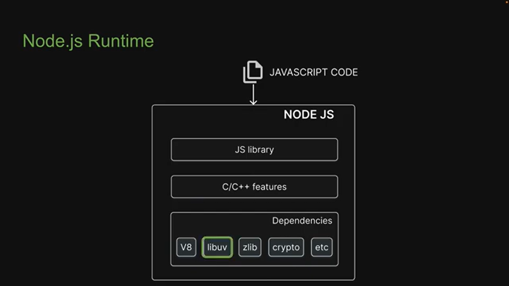
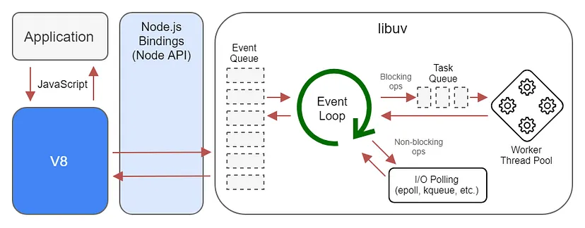
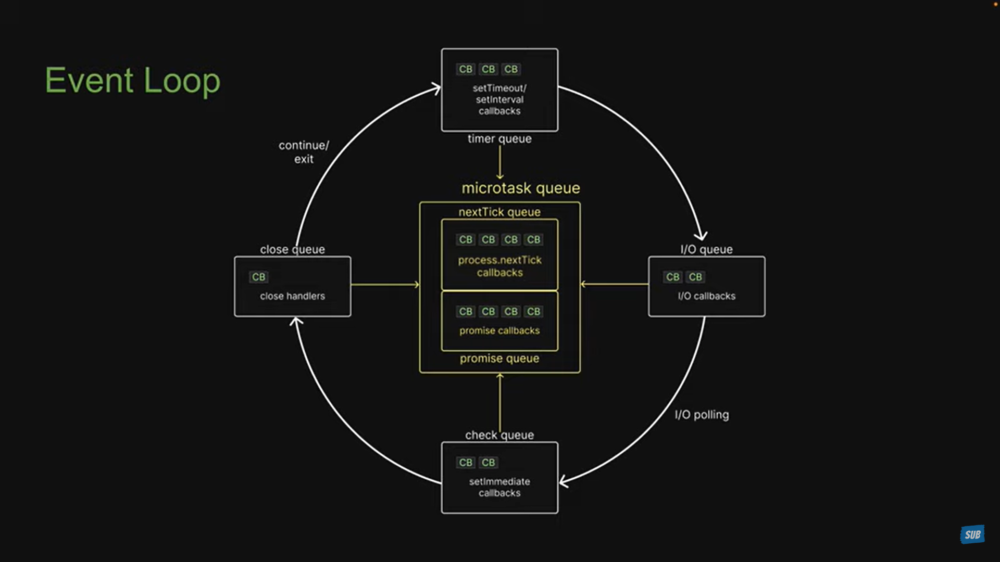

[<- MERN](mern-quick.md)

## What is NodeJS?
NodeJs is an open-source, cross-platform, runtime environment for developing server-side and networking applications. It is built on Google Chrome’s JavaScript V8 engine and uses JavaScript as a scripting language.

It allows to execution of the javascript code on the server (outside of the browser) on any machine. It is not a language & nor a framework. It's a Javascript runtime environment.

It works on single-threaded event loops and non-blocking I/O modal which provides a high rate as it can handle a higher number of concurrent requests.

## Event Loop, libuv, v8, Task Queue, Microtask Queue
1. [Event Loop](https://nodejs.org/en/docs/guides/event-loop-timers-and-nexttick/)

## Node Runtime


## Event Loop



Node.js is a combination of Google’s V8 JavaScript engine, an event loop, and a low-level I/O API(Node API).

Libuv is a multi-platform C library (that implements the event loop) that provides support for asynchronous I/O.

The Event loop is central to Libuv (a core component of the Node.js runtime), running on the main thread and managing tasks, processing I/O events, timers, and callbacks making Node.js applications highly responsive and scalable.

The Event loop is single-threaded, which means that it can only execute one task at a time. However, the event loop is also non-blocking, which means that it can continue to execute other tasks while it is waiting for an I/O operation to complete. This makes Node.js applications very responsive, as they can continue to handle other requests even while they are waiting for a file to be read or a network request to be completed.

Working: The way Libuv and the event loop work is based on the Reactor Pattern. In this pattern, there is an Event queue and an Event demultiplexer. The loop (i.e. the dispatcher) keeps listening for incoming I/O and for each new request, an event is emitted.

The event is received by the demultiplexer and it delegates work to the specific handler (the way these requests are handled differs for each OS). Once the work is done, the registered callback is enqueued on the Event queue. Then the callbacks are executed one by one and if there is nothing left to do, the process will exit.

## Phases of the event loop?
The Event Loop is composed of the following six phases, which are repeated for as long as the application still has code that needs to be executed:
- Timers
- I/O Callbacks
- Waiting / Preparation
- I/O Polling
- setImmediate() callbacks
- Close events

The Event Loop starts at the moment Node.js begins to execute your index.js file, or any other application entry point.

These six phases create one cycle, or loop, which is known as a tick. A Node.js process exits when there is no more pending work in the Event Loop, or when process.exit() is called manually.

Some phases are executed by the Event Loop itself, but for some of them the main tasks are passed to the asynchronous C++ APIs.

### Phase 1: timers: 
The timers phase is executed directly by the Event Loop. At the beginning of this phase, the Event Loop updates its own time. Then it checks a queue, or pool, of timers. This queue consists of all timers that are currently set. The Event Loop takes the timer with the shortest wait time and compares it with the Event Loop’s current time. If the wait time has elapsed, then the timer’s callback is queued to be called once the call stack is empty.

### Phase 2: I/O callbacks: 
This is a phase of non-blocking input/output. The asynchronous I/O request is recorded into the queue and then the main call stack can continue working as expected. In the second phase of the Event Loop the I/O callbacks of completed or errored out I/O operations are processed.

### Phase 3: idle / waiting / preparation: 
This is a housekeeping phase. During this phase, the Event Loop performs internal operations of any callbacks. It is primarily used for gathering information, and planning of what needs to be executed during the next tick of the Event Loop.

### Phase 4: I/O polling (poll phase): 
This is the phase in which all the JavaScript code that we write is executed, starting at the beginning of the file, and working down. Depending on the code it may execute immediately, or it may add something to the queue to be executed during a future tick of the Event Loop.

During this phase, the Event Loop is managing the I/O workload, calling the functions in the queue until the queue is empty, and calculating how long it should wait until moving to the next phase. All callbacks in this phase are called synchronously in the order that they were added to the queue, from oldest to newest.

Note: this phase is optional. It may not happen on every tick, depending on the state of your application.

If there are any setImmediate() timers scheduled, Node.js will skip this phase during the current tick and move to the setImmediate() phase.

### Phase 5: setImmediate() callbacks: 
Node.js has a special timer, setImmediate(), and its callbacks are executed during this phase. This phase runs as soon as the poll phase becomes idle. If setImmediate() is scheduled within the I/O cycle it will always be executed before other timers regardless of how many timers are present.

### Phase 6: close events: 
This phase executes the callbacks of all close events. For example, a close event of web socket callback, or when process.exit() is called. This is when the Event Loop is wrapping up one cycle and is ready to move to the next one. It is primarily used to clean the state of the application.

## What is the use of NodeJS binding?
In Node.js, bindings, also known as the Node API (Application Programming Interface), serve as the bridge between JavaScript code and C/C++ code. These bindings enable communication between Node.js and low-level system resources and libraries written in C or C++, allowing for interactions with hardware, operating system functionality, and other low-level operations that are not directly accessible from JavaScript.

The use of Node.js bindings is essential for several purposes, including:
- Accessing System Features
- Performance Optimization
- Integration with Existing Libraries
- System-level Functionality

## Thread Pool
1. [Thread Pool](https://nodejs.org/en/docs/guides/dont-block-the-event-loop/)
2. Default thread pool size is 4. It can be increased by setting the environment variable `UV_THREADPOOL_SIZE`.
3. Optimal size of thread pool is 4-8. Increasing the thread pool size can lead to performance degradation.
4. Thread pool size should be same as the number of CPU cores.
5. Thread pool size should be increased only if the application is CPU bound and not I/O bound.
6. Thread pool is used by crypto, zlib, fs, dns, http, https, net, tls, child_process, dgram, readline, and other modules.
7. Thread pool is used for blocking operations like file system operations, network operations, and crypto operations.
8. Thred pool is not used by setTimeout, setInterval, setImmediate, process.nextTick, and event emitters.

```js
const crypto = require("crypto");
const https = require("https");

// process.env.UV_THREADPOOL_SIZE = 16;

const start = Date.now();

const MAX_CALLS = 12;

for (let i = 0; i < MAX_CALLS; i++) {
  // crypto module uses thread pool
  // This functions execution speed will increase with the increase in the thread pool size
  // crypto.pbkdf2("a", "b", 100000, 512, "sha512", () => {
  //   console.log(`Hash: ${i + 1}`, Date.now() - start);
  // });

  // https module uses OS async operations (not thread pool)
  // This functions execution speed will not increase with the increase in the thread pool size
  https
    .request("https://www.google.com", (res) => {
      res.on("data", () => {});
      res.on("end", () => {
        console.log(`Request: ${i + 1}`, Date.now() - start);
      });
    })
    .end();
}
```

## Explain NodeJS Architecture in detail with diagramatic representation.

### **Node.js Architecture: A Detailed Explanation**
Node.js operates on a single-threaded, event-driven architecture powered by non-blocking I/O and a highly efficient event loop. Below is an in-depth look at the architecture’s components, workflow, and core systems.

### **1. Components of Node.js Architecture**

#### **a. Single-Threaded Event Loop**
- Core of Node.js; runs on a single thread.
- Processes multiple client requests asynchronously by offloading tasks to the system kernel or worker threads, ensuring high concurrency.

#### **b. V8 JavaScript Engine**
- A fast JavaScript engine developed by Google.
- Compiles JavaScript code into machine code for optimized execution.
- Ensures efficient runtime performance for JavaScript-based applications.

#### **c. Libuv**
- A library that provides low-level system utilities like asynchronous I/O, timers, and thread pooling.
- Core features include:
  - **Event Loop**: Manages non-blocking operations.
  - **Thread Pool**: Offloads heavy tasks (e.g., file system operations, DNS lookups) to worker threads.

#### **d. C++ Bindings**
- Used to bridge the gap between JavaScript and system-level operations.
- Facilitates interaction with the file system, network sockets, and other OS-level functionalities.

#### **e. Built-in Modules**
- Predefined modules like `fs` (file system), `http` (web server), and `net` (networking).
- Provide essential functionalities to avoid writing repetitive low-level code.

#### **f. External Modules**
- User-installed modules through npm (Node Package Manager), e.g., `express`, `axios`, etc.
- Extend the functionality of Node.js for specific use cases.

### **2. Workflow of Node.js Architecture**

#### **Step-by-Step Process**
1. **Incoming Request**:
   - Client sends a request to the server (HTTP, file operation, etc.).
   - Node.js receives the request and passes it to the **event loop**.

2. **Determine Request Type**:
   - **Light Operations**: Directly processed in the **event loop** (e.g., calculating a sum).
   - **Heavy Operations**: Offloaded to the **thread pool** via Libuv or directly handled by the system kernel (e.g., file I/O, database queries).

3. **Execution**:
   - The event loop continuously monitors tasks and executes callback functions for completed tasks.

4. **Response**:
   - Once a task is completed, its result is sent back to the client.

### **3. Core Architecture Components**

#### **a. Call Stack**
- Handles synchronous code execution in a **Last-In-First-Out (LIFO)** manner.
- Executes functions, then removes them once completed.

#### **b. Event Loop**
- The heart of Node.js, responsible for managing all asynchronous operations.
- Continuously checks the **event queue** for pending tasks and processes them when the stack is empty.

#### **c. Event Queue**
- A queue of tasks awaiting execution, such as:
  - Callback functions from asynchronous operations.
  - Promises and `setTimeout` tasks.
- Tasks are added to the queue and processed by the event loop.

#### **d. Worker Threads (Thread Pool)**
- Handles heavy or blocking operations, such as:
  - File system operations.
  - Database interactions.
  - Compression tasks.
- Runs in the background and returns the results to the event loop.

#### **e. Microtask Queue**
- Separate from the event queue.
- Processes high-priority tasks like resolved promises before moving to the event queue.

#### **f. System Kernel**
- Node.js often delegates low-level tasks to the operating system’s kernel (e.g., networking and file I/O), which can handle them more efficiently.

### **4. Textual Diagram of Node.js Architecture**

```plaintext

        Client Requests
              |
              v
+---------------------------+
|       Node.js             |
|                           |
| +---------------------+   |
| |    Call Stack       |   |  <== Executes synchronous code
| +---------------------+   |
|          |                |
|          v                |
| +---------------------+   |
| |    Event Loop       |   |  <== Continuously checks for tasks
| +---------------------+   |
|          |                |
|          v                |
| +----------------------+  |
| |   Microtask Queue    |  |  <== Handles resolved promises
| +----------------------+  |
|          |                |
|          v                |
| +----------------------+  |
| |    Event Queue       |  |  <== Processes I/O callbacks, timers
| +----------------------+  |
|          |                |
|          v                |
| +----------------------+  |
| |   Worker Threads     |  |  <== Offloads heavy tasks
| +----------------------+  |
|                           |
+---------------------------+
            |
            v
      Client Responses

```

### **5. How It All Works Together**
1. **Synchronous Execution**:
   - Executes synchronous tasks in the **call stack** first.
   - Once complete, proceeds to asynchronous tasks.

2. **Asynchronous Execution**:
   - Delegates I/O operations to the **worker threads** or OS kernel.
   - Adds callback functions to the **event queue**.

3. **Prioritization**:
   - Processes the **microtask queue** (e.g., resolved promises) before moving to the **event queue**.

4. **Event Loop**:
   - Monitors the **call stack**, **event queue**, and **microtask queue** continuously.
   - Ensures tasks are executed in the correct order and the server remains responsive.

### **Key Takeaways**
- **Event Loop** is the central mechanism ensuring non-blocking execution.
- **Libuv** provides asynchronous capabilities like thread pooling and event-driven I/O.
- Tasks are prioritized using the **microtask queue** and **event queue** to handle promises and I/O callbacks efficiently.


## How the nodejs event loop will execute the Promis.all method?

### **What is `Promise.all()`?**
`Promise.all()` takes an array of promises and returns a single promise that resolves when all promises in the array are resolved. If any promise rejects, the returned promise immediately rejects.

### **Event Loop Execution of `Promise.all()`**
1. **Initialization**:
   - When `Promise.all()` is called, all the promises in the array are immediately scheduled for execution.

2. **Promise Resolution**:
   - Each promise starts executing asynchronously in the **microtask queue**. The event loop prioritizes **microtasks** (like `Promise.then()`) over the **task queue** (e.g., `setTimeout`).

3. **Collecting Results**:
   - As each promise resolves, its result is stored.
   - If all promises resolve, `Promise.all()` itself resolves with an array of results.
   - If any promise rejects, `Promise.all()` immediately rejects, and further resolutions are ignored.

4. **Execution in the Event Loop**:
   - The promises in `Promise.all()` are processed in the **microtask queue** after the current JavaScript stack finishes execution.

### **Example Execution**

#### Code Example:
```javascript
console.log("Start");

const p1 = new Promise((resolve) => setTimeout(() => resolve("P1 Resolved"), 100));
const p2 = new Promise((resolve) => setTimeout(() => resolve("P2 Resolved"), 50));
const p3 = new Promise((resolve) => resolve("P3 Resolved"));

Promise.all([p1, p2, p3])
  .then((results) => console.log("Promise.all Resolved:", results))
  .catch((err) => console.log("Promise.all Rejected:", err));

console.log("End");
```

### **Diagrammatic Representation**

#### Event Loop Stages:
1. **Call Stack**:
   - Executes synchronous code (`console.log("Start")`, `console.log("End")`).
   
2. **Microtask Queue**:
   - Handles promises as they resolve (`p1`, `p2`, `p3`).

3. **Task Queue**:
   - Executes `setTimeout` callbacks after promises (if applicable).

### **Execution Flow Diagram**

```plaintext
Time 0ms (Initialization):
   Call Stack: console.log("Start") --> console.log("End")
   Microtask Queue: []
   Task Queue: []

Time 50ms:
   Call Stack: (empty)
   Microtask Queue: p2 resolved
   Task Queue: setTimeout for p2

Time 100ms:
   Call Stack: (empty)
   Microtask Queue: p1 resolved
   Task Queue: setTimeout for p1

Final Phase:
   Call Stack: (empty)
   Microtask Queue: Process results of Promise.all
   Task Queue: (empty)

Output:
   "Start"
   "End"
   "Promise.all Resolved: ['P1 Resolved', 'P2 Resolved', 'P3 Resolved']"
```

### **Key Points**
1. **Synchronous Code First**: The event loop always completes synchronous code before handling promises.
2. **Promise.all Resolves Once**: It waits for all promises to resolve (or for the first rejection) before resolving itself.
3. **Microtasks Are Prioritized**: Resolved promises are processed in the microtask queue before moving to the next event loop phase.

---

## What are the web APIs and queues in the event loop?
The event loop is a core concept in JavaScript that enables asynchronous behavior by coordinating the execution of code, handling events, and managing asynchronous callbacks. When we talk about the **Web APIs** and **queues** in the event loop, we’re referring to the external environment (provided by the browser or Node.js) and the various queues that manage when callbacks are executed. Let’s break down these components and see how they work together.

## 1. The Call Stack

- **What It Is:**  
  The call stack is where your JavaScript code is executed. When a function is called, it’s pushed onto the stack, and once it completes, it’s popped off.

- **Role in the Event Loop:**  
  The event loop continuously checks the call stack. When the stack is empty, it looks at the queues to see if there are callbacks waiting to be executed.

## 2. Web APIs

- **Definition:**  
  Web APIs are functions provided by the browser (or host environment like Node.js) that perform asynchronous tasks. These are not part of the core JavaScript language but are available in the environment.

- **Examples in the Browser:**
  - **Timers:** `setTimeout()`, `setInterval()`
  - **DOM Events:** Clicks, keyboard events, etc.
  - **HTTP Requests:** `fetch()`, `XMLHttpRequest`
  - **Others:** Geolocation, WebSockets, etc.

- **How They Work:**  
  When you call a function like `setTimeout()`, the timer is handled by the browser’s Web API. The JavaScript engine doesn’t wait for the timer; instead, the browser handles the timing in the background. Once the timer expires, the associated callback isn’t executed immediately—it’s placed into a queue (typically a macrotask queue) to be run when the call stack is free.

## 3. Queues

The event loop uses queues to manage callbacks that are waiting to be executed. The two main types are:

### A. Macrotask (Task) Queue

- **What It Contains:**  
  This queue holds callbacks from operations such as:
  - `setTimeout` and `setInterval`
  - I/O events (like mouse clicks or network responses)
  - Other asynchronous events managed by the browser or Node.js

- **Execution:**  
  When the call stack is empty, the event loop takes the first callback from the macrotask queue and pushes it onto the call stack for execution.

### B. Microtask Queue

- **What It Contains:**  
  This queue is for higher-priority tasks that need to be executed as soon as possible after the current script execution, including:
  - Promise callbacks (e.g., `.then()` and `.catch()`)
  - MutationObserver callbacks in the browser
  - In Node.js, certain callbacks like those scheduled with `process.nextTick()` (though Node.js has its own nuances)

- **Execution:**  
  After the current task completes and before the event loop picks the next macrotask, it will process all callbacks in the microtask queue. This ensures that promise resolutions and similar tasks are handled quickly.

## 4. The Event Loop in Action

Here’s a simple example that demonstrates how these components work together:

```javascript
console.log('Script start');

// Web API: setTimeout schedules a callback to run after 0 milliseconds
setTimeout(() => {
  console.log('setTimeout callback (macrotask)');
}, 0);

// Web API: A promise is resolved immediately
Promise.resolve().then(() => {
  console.log('Promise callback (microtask)');
});

console.log('Script end');
```

**Execution Breakdown:**

1. **Call Stack Execution:**  
   - `'Script start'` is logged.
   - `setTimeout` is called; its timer is handled by the browser’s Web API.
   - `Promise.resolve()` is called, and its `.then()` callback is scheduled in the microtask queue.
   - `'Script end'` is logged.

2. **After Synchronous Code Completes:**  
   - The call stack is now empty.
   - The event loop checks the microtask queue first.
   - The promise’s callback is executed, logging `'Promise callback (microtask)'`.

3. **Macrotask Execution:**  
   - The event loop then moves to the macrotask queue.
   - The callback from `setTimeout` is executed, logging `'setTimeout callback (macrotask)'`.

**Expected Console Output:**

```
Script start
Script end
Promise callback (microtask)
setTimeout callback (macrotask)
```

## 5. Summary

- **Web APIs:**  
  They handle asynchronous operations like timers, DOM events, and HTTP requests. Once an operation completes, its callback is pushed into an appropriate queue.

- **Queues:**
  - **Macrotask Queue:** For callbacks from timers, I/O events, etc.
  - **Microtask Queue:** For promise resolutions and other high-priority tasks.
  
- **Event Loop Process:**  
  The event loop continuously checks if the call stack is empty, then:
  1. Processes **all microtasks** (ensuring that promise callbacks, etc., run before any next macrotask).
  2. Takes the next macrotask from the task queue and pushes it onto the call stack.
  
This mechanism allows JavaScript to handle asynchronous operations efficiently while keeping the code non-blocking and responsive.

---

[<- MERN](mern-quick.md)

