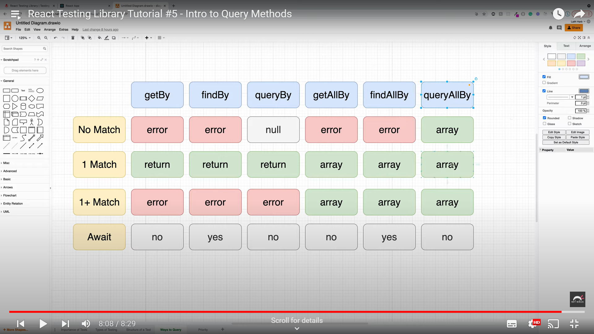

[<- react-quick](react-quick.md)

# React Testing Library

React Testing Library (RTL) is a popular testing library for React applications, designed to help you write tests that closely resemble how users interact with your application. It encourages writing tests based on user behavior rather than implementation details, making tests more reliable and less brittle.

## Core Concepts

1. **Focus on User Interactions**: RTL is all about simulating how users would interact with the components—filling forms, clicking buttons, etc.—and making assertions based on what users see on the screen.
  
2. **Testing DOM, Not Implementation**: RTL promotes testing the rendered output (i.e., the DOM) of components rather than their internal logic or state. This reduces the likelihood of writing tests that break with minor refactorings that don’t affect behavior.

3. **React Integration**: RTL works well with React's component structure and supports testing React components by rendering them in a test environment.

4. **No Need for Shallow Rendering**: In contrast to some other testing libraries (like Enzyme), RTL doesn’t encourage shallow rendering. It promotes full rendering and interaction with the entire DOM tree of your component.

## Installation

You can install React Testing Library along with Jest (if you don’t have Jest set up) using the following command:

```bash
npm install --save-dev @testing-library/react @testing-library/jest-dom
```

- **`@testing-library/react`**: The main React Testing Library package.
- **`@testing-library/jest-dom`**: Provides additional DOM matchers for Jest (like `toBeInTheDocument()`).

## Example Components and Tests

We’ll go through examples that cover:
1. Basic rendering tests.
2. Interaction tests (clicks, form inputs).
3. Testing asynchronous code (such as API requests).
4. Mocking functions and external dependencies.

## 1. **Basic Rendering Tests**

First, let’s start by testing if a component renders correctly.

### Component: `Greeting.js`

```javascript
// Greeting.js
import React from 'react';

const Greeting = ({ name }) => {
  return <h1>Hello, {name || 'Guest'}!</h1>;
};

export default Greeting;
```

### Test: `Greeting.test.js`

```javascript
// Greeting.test.js
import { render, screen } from '@testing-library/react';
import Greeting from './Greeting';

test('renders with default greeting', () => {
  render(<Greeting />);
  const greetingElement = screen.getByText(/hello, guest/i); // case-insensitive match
  expect(greetingElement).toBeInTheDocument(); // provided by @testing-library/jest-dom
});

test('renders with a given name', () => {
  render(<Greeting name="John" />);
  const greetingElement = screen.getByText(/hello, john/i);
  expect(greetingElement).toBeInTheDocument();
});
```

**Explanation**:
- `render(<Greeting />)`: Renders the `Greeting` component.
- `screen.getByText()`: Queries the DOM for a specific element based on the visible text.
- `expect().toBeInTheDocument()`: Asserts that the queried element is in the document.

## 2. **Testing User Interactions**

Let’s now test how the user interacts with a button. We’ll create a button that toggles the visibility of some text when clicked.

### Component: `Toggle.js`

```javascript
// Toggle.js
import React, { useState } from 'react';

const Toggle = () => {
  const [isVisible, setIsVisible] = useState(false);

  return (
    <div>
      <button onClick={() => setIsVisible((prev) => !prev)}>
        {isVisible ? 'Hide' : 'Show'}
      </button>
      {isVisible && <p>This is some text</p>}
    </div>
  );
};

export default Toggle;
```

### Test: `Toggle.test.js`

```javascript
// Toggle.test.js
import { render, screen, fireEvent } from '@testing-library/react';
import Toggle from './Toggle';

test('toggles text visibility when the button is clicked', () => {
  render(<Toggle />);

  // Initially, the text should not be visible
  const toggleButton = screen.getByText(/show/i);
  expect(toggleButton).toBeInTheDocument();
  expect(screen.queryByText(/this is some text/i)).toBeNull();

  // Click the button to show the text
  fireEvent.click(toggleButton);
  expect(screen.getByText(/this is some text/i)).toBeInTheDocument();
  expect(screen.getByText(/hide/i)).toBeInTheDocument();

  // Click the button again to hide the text
  fireEvent.click(screen.getByText(/hide/i));
  expect(screen.queryByText(/this is some text/i)).toBeNull();
});
```

**Explanation**:
- `fireEvent.click()`: Simulates a click event.
- `screen.queryByText()`: Returns `null` if the element is not found, which is useful when checking for elements that may not exist in the DOM.

## 3. **Testing Asynchronous Code**

Next, let’s simulate an asynchronous operation like fetching data from an API.

### Component: `FetchGreeting.js`

```javascript
// FetchGreeting.js
import React, { useEffect, useState } from 'react';

const FetchGreeting = () => {
  const [greeting, setGreeting] = useState('Loading...');

  useEffect(() => {
    setTimeout(() => {
      setGreeting('Hello from the API');
    }, 1000); // Simulates an API call
  }, []);

  return <h1>{greeting}</h1>;
};

export default FetchGreeting;
```

### Test: `FetchGreeting.test.js`

```javascript
// FetchGreeting.test.js
import { render, screen, waitFor } from '@testing-library/react';
import FetchGreeting from './FetchGreeting';

test('displays the greeting from the API after loading', async () => {
  render(<FetchGreeting />);

  // Check for loading state initially
  expect(screen.getByText(/loading/i)).toBeInTheDocument();

  // Wait for the greeting to appear
  await waitFor(() => expect(screen.getByText(/hello from the api/i)).toBeInTheDocument());
});
```

**Explanation**:
- `waitFor()`: Waits for the DOM to change and resolves when the expected element appears. This is useful for testing asynchronous code.

## 4. **Mocking Functions (e.g., API Calls)**

Let’s say we need to mock an API call in our component to avoid making real requests during testing.

### Component: `UserProfile.js`

```javascript
// UserProfile.js
import React, { useEffect, useState } from 'react';

const UserProfile = ({ getUserData }) => {
  const [user, setUser] = useState(null);

  useEffect(() => {
    getUserData().then((data) => setUser(data));
  }, [getUserData]);

  if (!user) {
    return <p>Loading...</p>;
  }

  return (
    <div>
      <h1>{user.name}</h1>
      <p>{user.email}</p>
    </div>
  );
};

export default UserProfile;
```

### Test: `UserProfile.test.js`

```javascript
// UserProfile.test.js
import { render, screen } from '@testing-library/react';
import UserProfile from './UserProfile';

test('displays user data after API call', async () => {
  // Mock the API function
  const mockGetUserData = jest.fn(() =>
    Promise.resolve({
      name: 'John Doe',
      email: 'john@example.com',
    })
  );

  render(<UserProfile getUserData={mockGetUserData} />);

  // Initially shows loading text
  expect(screen.getByText(/loading/i)).toBeInTheDocument();

  // Wait for the user data to be displayed
  expect(await screen.findByText(/john doe/i)).toBeInTheDocument();
  expect(screen.getByText(/john@example.com/i)).toBeInTheDocument();
});
```

**Explanation**:
- `jest.fn()`: Creates a mock function. We mock the `getUserData` function to return a resolved promise with user data.
- `screen.findByText()`: This is an asynchronous query that waits for the text to appear in the DOM.

## 5. **FireEvent vs. UserEvent**

`fireEvent` is the default way of simulating events, but there is also a more user-friendly API called `userEvent` (from the `@testing-library/user-event` package), which better simulates real-world interactions (e.g., typing text into an input).

### Example: Simulating typing

```javascript
// InputField.js
import React, { useState } from 'react';

const InputField = () => {
  const [value, setValue] = useState('');

  return (
    <div>
      <input
        type="text"
        value={value}
        onChange={(e) => setValue(e.target.value)}
        placeholder="Type here"
      />
      <p>{value}</p>
    </div>
  );
};

export default InputField;
```

### Test with `userEvent`:

```javascript
// InputField.test.js
import { render, screen } from '@testing-library/react';
import userEvent from '@testing-library/user-event';
import InputField from './InputField';

test('updates input value on typing', () => {
  render(<InputField />);

  const input = screen.getByPlaceholderText(/type here/i);

  // Simulate typing into the input field
  userEvent.type(input, 'Hello, World!');

  //

 Expect the value to be displayed
  expect(screen.getByText(/hello, world!/i)).toBeInTheDocument();
});
```

## Summary of React Testing Library:
- **Rendering Components**: Use `render()` to render your component in a testing environment.
- **Queries**: Use `screen.getBy...` or `screen.queryBy...` to find elements in the DOM.
- **Events**: Use `fireEvent` or `userEvent` to simulate user interactions (e.g., clicks, typing).
- **Async Testing**: Use `waitFor()` or `findBy...` for handling async operations.
- **Mocking**: Use `jest.fn()` to mock API calls or other external functions.

By focusing on testing how users interact with your app (rather than the internal implementation), React Testing Library makes tests more robust and easier to maintain.

## Query Methods


---

[<- react-quick](react-quick.md)
